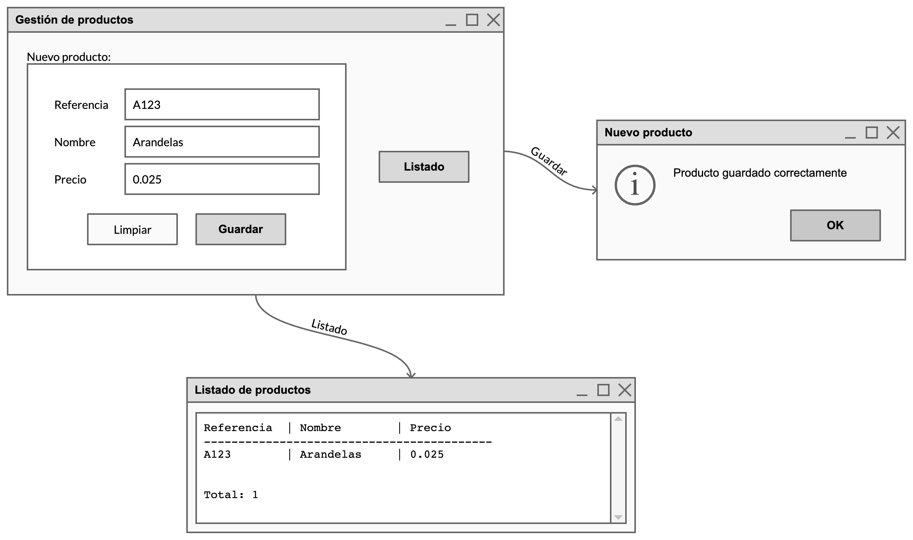
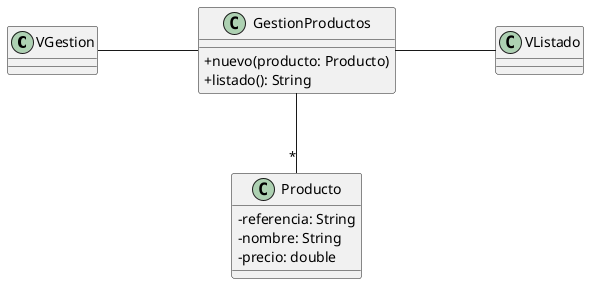

# Gestión de productos

Nuestro cliente nos ha proporcionado este *mockup* de una aplicación que quiere que le programemos:

También nos proporciona este diagrama de clases para que lo sigamos:

Se nos pide:

- Construir el interfaz de usuario usando Swing.
- Almacenar los datos en una estructura tipo `List<E>`.
- Mostrar los datos almacenados en la estructura usando un `JTextArea`.
